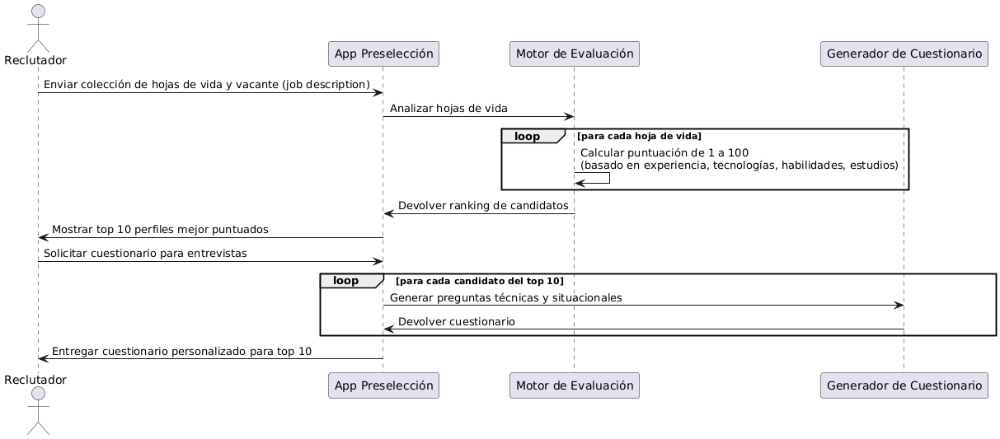
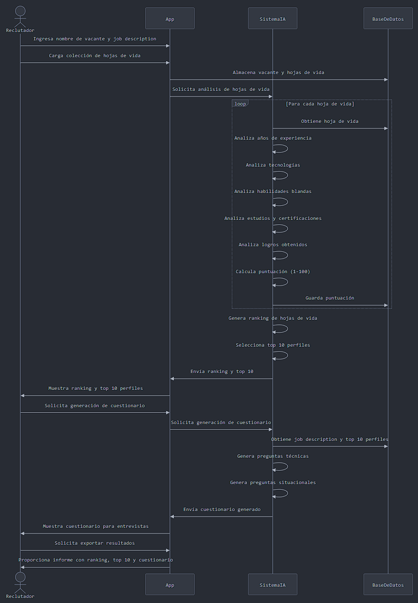
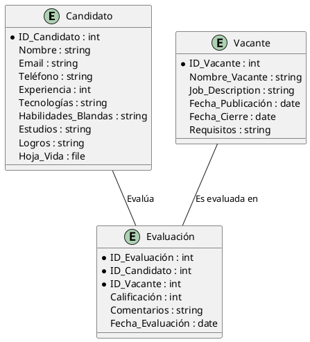

# Fase 1: Planeando un software con GenAI

## Prompt #1

Dame un ejemplo de un diagrama de secuencia en PlantUML de una aplicación que ayuda en el proceso de preselección (reclutamiento TI), que recibe una colección de hojas de vida, el nombre de la vacante con un job description y realiza las siguientes actividades: 
1. Genera una calificación de 1 a 100 para cada una de estas hojas de vida según atributos como años de experiencia, tecnologías, habilidades blandas, estudios y certificaciones, logros obtenidos. Luego genera un ranking con todas las hojas de vida y muestra un top 10 de los mejores perfiles. 
2. Formula un guión de cuestionario para apoyar la entrevista que debe realizarse a los top 10 candidatos. Con preguntas tanto técnicas como de situaciones del día a día para ayudar al entrevistador a validar los puntos clave que solicita la vacante.

### ChatGPT

```
@startuml
actor Reclutador
participant "App Preselección" as App
participant "Motor de Evaluación" as Evaluacion
participant "Generador de Cuestionario" as Cuestionario

Reclutador -> App: Enviar colección de hojas de vida y vacante (job description)
App -> Evaluacion: Analizar hojas de vida

loop para cada hoja de vida
    Evaluacion -> Evaluacion: Calcular puntuación de 1 a 100\n(basado en experiencia, tecnologías, habilidades, estudios)
end

Evaluacion -> App: Devolver ranking de candidatos
App -> Reclutador: Mostrar top 10 perfiles mejor puntuados

Reclutador -> App: Solicitar cuestionario para entrevistas

loop para cada candidato del top 10
    App -> Cuestionario: Generar preguntas técnicas y situacionales
    Cuestionario -> App: Devolver cuestionario
end

App -> Reclutador: Entregar cuestionario personalizado para top 10

@enduml
```

### Claude

```
sequenceDiagram
    actor Reclutador
    participant App
    participant SistemaIA
    participant BaseDeDatos

    Reclutador->>App: Ingresa nombre de vacante y job description
    Reclutador->>App: Carga colección de hojas de vida
    App->>BaseDeDatos: Almacena vacante y hojas de vida
    App->>SistemaIA: Solicita análisis de hojas de vida

    loop Para cada hoja de vida
        SistemaIA->>BaseDeDatos: Obtiene hoja de vida
        SistemaIA->>SistemaIA: Analiza años de experiencia
        SistemaIA->>SistemaIA: Analiza tecnologías
        SistemaIA->>SistemaIA: Analiza habilidades blandas
        SistemaIA->>SistemaIA: Analiza estudios y certificaciones
        SistemaIA->>SistemaIA: Analiza logros obtenidos
        SistemaIA->>SistemaIA: Calcula puntuación (1-100)
        SistemaIA->>BaseDeDatos: Guarda puntuación
    end

    SistemaIA->>SistemaIA: Genera ranking de hojas de vida
    SistemaIA->>SistemaIA: Selecciona top 10 perfiles
    SistemaIA->>App: Envía ranking y top 10

    App->>Reclutador: Muestra ranking y top 10 perfiles

    Reclutador->>App: Solicita generación de cuestionario
    App->>SistemaIA: Solicita generación de cuestionario

    SistemaIA->>BaseDeDatos: Obtiene job description y top 10 perfiles
    SistemaIA->>SistemaIA: Genera preguntas técnicas
    SistemaIA->>SistemaIA: Genera preguntas situacionales
    SistemaIA->>App: Envía cuestionario generado

    App->>Reclutador: Muestra cuestionario para entrevistas

    Reclutador->>App: Solicita exportar resultados
    App->>Reclutador: Proporciona informe con ranking, top 10 y cuestionario

```

## Prompt #2
Me puedes mostrar la gráfica de ese lenguaje?


### ChatGPT




### Claude




## Prompt #3
Ahora ayúdame a crear el diagrams de arquitectura utilizando la librería Diagram y Python para pintarla suponiendo que uso AWS

### ChatGPT

```
from diagrams import Diagram
from diagrams.aws.compute import EC2
from diagrams.aws.database import RDS
from diagrams.aws.network import ELB, Route53
from diagrams.aws.storage import S3
from diagrams.aws.analytics import Kinesis
from diagrams.aws.integration import SQS
from diagrams.aws.security import IAM
from diagrams.aws.management import Cloudwatch
from diagrams.aws.devtools import Codepipeline, Codebuild

with Diagram("Arquitectura Preselección de Candidatos", show=False):
    # DNS and Load Balancer
    dns = Route53("DNS")
    load_balancer = ELB("Load Balancer")

    # EC2 instances for application services
    app_service = EC2("Servicio de Preselección")
    eval_service = EC2("Motor de Evaluación")
    question_service = EC2("Generador de Cuestionarios")

    # S3 for storage, RDS for databases
    storage = S3("Hojas de Vida (S3)")
    database = RDS("Base de Datos Candidatos (RDS)")

    # Logging, monitoring, and CI/CD pipeline
    logs = Cloudwatch("Logs y Monitoreo")
    ci_cd = Codepipeline("CI/CD Pipeline")
    build_service = Codebuild("Proceso de Build")

    # Queue system and analytics
    queue = SQS("Cola de Mensajes (SQS)")
    analytics = Kinesis("Análisis de Datos")

    # Security and access management
    security = IAM("IAM Roles")

    # Architecture flow
    dns >> load_balancer >> app_service
    app_service >> eval_service
    app_service >> question_service
    app_service >> storage
    app_service >> database
    app_service >> logs
    app_service >> queue
    app_service >> analytics

    eval_service >> storage
    eval_service >> database
    eval_service >> logs

    question_service >> database
    question_service >> logs

    ci_cd >> build_service >> app_service
    security >> [app_service, storage, database]
```

### Claude

```
from diagrams import Diagram, Cluster
from diagrams.aws.compute import ECS, Lambda
from diagrams.aws.database import RDS, ElastiCache
from diagrams.aws.storage import S3
from diagrams.aws.security import Cognito
from diagrams.aws.integration import SQS
from diagrams.aws.ml import SageMaker
from diagrams.aws.network import ELB, APIGateway
from diagrams.aws.general import Users

with Diagram("Arquitectura de App de Preselección de Reclutamiento en AWS", show=False):
    users = Users("Reclutadores")

    with Cluster("Frontend"):
        lb = ELB("Load Balancer")
        web_app = ECS("Web App")

    with Cluster("Backend"):
        api = APIGateway("API Gateway")
        
        with Cluster("Microservicios"):
            upload_service = ECS("Servicio de Carga")
            analysis_service = ECS("Servicio de Análisis")
            ranking_service = ECS("Servicio de Ranking")
            questionnaire_service = ECS("Servicio de Cuestionario")

        auth = Cognito("Autenticación")

        queue = SQS("Cola de Procesamiento")

        with Cluster("Almacenamiento"):
            cv_storage = S3("Almacenamiento CV")
            db = RDS("Base de Datos")
            cache = ElastiCache("Cache")

        with Cluster("Procesamiento IA"):
            cv_analysis = SageMaker("Análisis de CV")
            ranking_model = SageMaker("Modelo de Ranking")
            questionnaire_gen = SageMaker("Generación de Cuestionario")

        with Cluster("Funciones Serverless"):
            notification = Lambda("Notificaciones")
            export = Lambda("Exportación de Informes")

    users >> lb >> web_app >> api

    api >> auth
    api >> upload_service >> cv_storage
    api >> analysis_service >> queue
    api >> ranking_service
    api >> questionnaire_service

    queue >> cv_analysis
    cv_analysis >> ranking_model
    ranking_model >> ranking_service
    questionnaire_service >> questionnaire_gen

    upload_service >> db
    analysis_service >> db
    ranking_service >> db
    questionnaire_service >> db

    [upload_service, analysis_service, ranking_service, questionnaire_service] >> cache

    ranking_service >> notification
    questionnaire_service >> notification
    api >> export
```

# Fase 2: Trabajando como Tech Lead con GenAI

## Prompt 1 

Eres un experto en producto, con experiencia en SISTEMAS DE RECLUTAMENTO DE PERSONAL TI. ¿Qué funcionalidades básicas tiene un SISTEMA DE PERSONAL TI? Descríbemelas en un listado, ordenado de mayor a menor prioridad. Recuerda solo incluir las funcionalidades básicas que te mencioné anteriormente. 


```
Como experto en producto con experiencia en sistemas de reclutamiento de personal TI, puedo proporcionarte un listado de las funcionalidades básicas que mencionaste anteriormente, ordenadas de mayor a menor prioridad:

1. Gestión de hojas de vida (CVs):
   - Recepción y almacenamiento de CVs
   - Organización y categorización de CVs por vacante

2. Análisis automatizado de CVs:
   - Evaluación de años de experiencia
   - Identificación de tecnologías y habilidades técnicas
   - Reconocimiento de habilidades blandas
   - Análisis de estudios y certificaciones
   - Identificación de logros relevantes

3. Sistema de puntuación y ranking:
   - Calificación de CVs en escala de 1 a 100
   - Generación de ranking basado en las puntuaciones
   - Identificación y presentación del top 10 de perfiles

4. Generación de cuestionarios para entrevistas:
   - Creación de preguntas técnicas basadas en el job description
   - Formulación de preguntas situacionales relevantes
   - Adaptación del cuestionario a los perfiles top

5. Gestión de vacantes:
   - Registro de nuevas vacantes
   - Almacenamiento y gestión de job descriptions

6. Interfaz de usuario para reclutadores:
   - Visualización del ranking y top 10 de candidatos
   - Acceso a cuestionarios generados para entrevistas

7. Exportación de resultados:
   - Generación de informes con ranking, top 10 y cuestionarios

Estas funcionalidades básicas forman el núcleo de un sistema de reclutamiento de personal TI eficiente, permitiendo una preselección automatizada y apoyo en el proceso de entrevistas. La priorización se basa en el flujo lógico del proceso de reclutamiento y en la importancia relativa de cada función para agilizar y mejorar el proceso de selección.
```

## Prompt #2
¿Qué beneficios obtiene el cliente de un SISTEMAS DE RECLUTAMENTO DE PERSONAL TI para considerar su uso?

```
Los beneficios de un sistema de reclutamiento de personal TI para los clientes incluyen:
Como experto en producto con experiencia en sistemas de reclutamiento de personal TI, puedo señalar varios beneficios clave que los clientes obtienen al utilizar este tipo de sistemas. Estos beneficios son los que generalmente impulsan la adopción de estas herramientas:

1. Ahorro de tiempo:
   - Automatización de la revisión inicial de CVs, reduciendo drásticamente el tiempo dedicado a la preselección manual.
   - Generación rápida de rankings y cuestionarios, acelerando el proceso de preparación para entrevistas.

2. Mejora en la calidad de las contrataciones:
   - Evaluación objetiva y consistente de los candidatos basada en criterios predefinidos.
   - Identificación más precisa de los mejores perfiles para cada vacante.

3. Reducción de sesgos en la selección:
   - Evaluación basada en datos y criterios objetivos, minimizando los sesgos inconscientes en la preselección.

4. Eficiencia en costos:
   - Reducción de horas-hombre dedicadas a la revisión manual de CVs.
   - Disminución de costos asociados a malas contrataciones debido a una mejor preselección.

5. Escalabilidad del proceso de reclutamiento:
   - Capacidad para manejar un gran volumen de aplicaciones sin comprometer la calidad del proceso.
   - Facilidad para gestionar múltiples vacantes simultáneamente.

6. Mejora en la experiencia del candidato:
   - Proceso de aplicación más rápido y transparente.
   - Evaluación justa y objetiva de sus habilidades y experiencia.

7. Estandarización del proceso de selección:
   - Aplicación consistente de criterios de evaluación en todas las vacantes.
   - Generación de cuestionarios estandarizados para entrevistas, asegurando una evaluación uniforme.

8. Toma de decisiones basada en datos:
   - Generación de métricas y análisis sobre el proceso de reclutamiento.
   - Identificación de tendencias en las habilidades y perfiles de los candidatos.

9. Mejora continua del proceso:
   - Capacidad de ajustar y refinar los criterios de evaluación basándose en el desempeño de las contrataciones previas.

10. Ventaja competitiva en el mercado laboral:
    - Capacidad para identificar y contactar rápidamente a los mejores candidatos.
    - Mejora en la imagen de la empresa como organización tecnológicamente avanzada.

11. Cumplimiento normativo:
    - Mantenimiento de registros detallados del proceso de selección, útiles para auditorías o requerimientos legales.

12. Integración con otros sistemas de RRHH:
    - Posibilidad de conectar con sistemas de gestión de empleados, facilitando la transición de candidato a empleado.

Estos beneficios hacen que un sistema de reclutamiento de personal TI sea una herramienta valiosa para las empresas que buscan optimizar su proceso de contratación, especialmente en un mercado laboral competitivo donde la rapidez y la precisión en la identificación de talento son cruciales.
```

## Prompt #3   
¿Cómo es el customer journey normal de un cliente que usa un SISTEMAS DE RECLUTAMENTO DE PERSONAL TI? Descríbeme paso a paso todas las interacciones

```
Como experto en producto, te describiré el customer journey típico de un cliente que utiliza un sistema de reclutamiento de personal TI, detallando paso a paso las interacciones:

1. Descubrimiento y Evaluación:
   - El cliente (generalmente un gerente de RRHH o de reclutamiento) identifica la necesidad de mejorar su proceso de reclutamiento.
   - Investiga soluciones en línea, lee reseñas y comparativas de sistemas de reclutamiento TI.
   - Solicita demostraciones o pruebas gratuitas de diferentes sistemas.

2. Decisión y Adquisición:
   - Evalúa las opciones y selecciona el sistema más adecuado para sus necesidades.
   - Negocia términos, precios y firma el contrato de servicio.
   - Realiza el pago inicial o configura el método de pago recurrente.

3. Onboarding y Configuración:
   - Recibe credenciales de acceso al sistema.
   - Participa en sesiones de capacitación ofrecidas por el proveedor.
   - Configura el sistema según las necesidades específicas de la empresa (criterios de evaluación, plantillas de job descriptions, etc.).
   - Integra el sistema con otras herramientas de RRHH existentes.

4. Creación de la Primera Vacante:
   - Ingresa al sistema y crea una nueva vacante.
   - Define el job description, requisitos y criterios de evaluación.

5. Carga de CVs:
   - Sube los CVs recibidos para la vacante al sistema.
   - Alternativamente, configura la recepción automática de CVs desde portales de empleo o el sitio web de la empresa.

6. Proceso de Análisis Automatizado:
   - Inicia el proceso de análisis de CVs.
   - Observa cómo el sistema evalúa y puntúa cada CV según los criterios establecidos.

7. Revisión de Resultados:
   - Accede al ranking generado por el sistema.
   - Examina el top 10 de perfiles seleccionados.
   - Revisa las puntuaciones y justificaciones para cada candidato.

8. Preparación para Entrevistas:
   - Solicita al sistema la generación de cuestionarios para entrevistas.
   - Revisa y personaliza las preguntas generadas si es necesario.

9. Realización de Entrevistas:
   - Utiliza los cuestionarios generados durante las entrevistas con los candidatos seleccionados.
   - Ingresa notas y evaluaciones de las entrevistas en el sistema.

10. Toma de Decisiones:
    - Utiliza la información del sistema (rankings, evaluaciones de entrevistas) para tomar decisiones de contratación.
    - Marca en el sistema a los candidatos seleccionados para seguimiento.

11. Seguimiento Post-contratación:
    - Actualiza el estado de la vacante en el sistema.
    - Posiblemente, inicia el proceso de onboarding del candidato seleccionado a través del sistema.

12. Análisis y Reportes:
    - Genera reportes sobre el proceso de reclutamiento (tiempo promedio de contratación, fuentes de candidatos más efectivas, etc.).
    - Revisa métricas y KPIs del proceso de reclutamiento.

13. Ajuste y Optimización:
    - Basándose en los resultados, ajusta los criterios de evaluación o los procesos en el sistema.
    - Solicita soporte o nuevas funcionalidades al proveedor si es necesario.

14. Renovación o Expansión:
    - Evalúa el ROI del sistema.
    - Decide sobre la renovación del servicio o la expansión a más módulos o licencias.

15. Feedback Continuo:
    - Proporciona feedback al proveedor sobre la experiencia de uso.
    - Participa en encuestas de satisfacción o grupos de usuarios.

Este journey muestra cómo el cliente interactúa con el sistema en cada etapa del proceso de reclutamiento, desde la configuración inicial hasta la mejora continua del proceso, pasando por todas las etapas de selección y contratación de candidatos.
```

## Planeación del sistema desde los casos de uso

### Prompt #1

Eres un analista de software experto. Estoy construyendo un MVP de un SISTEMA DE RECLUTAMENTO DE PERSONAL TI que sólamente genera una calificación de 1 a 100 para cada una de estas hojas de vida según atributos como años de experiencia, tecnologías, habilidades blandas, estudios y certificaciones, logros obtenidos. Genera un ranking con todas las hojas de vida y muestra un top 10 de los mejores perfiles. Y formula un guión de cuestionario para apoyar la entrevista que debe realizarse a los top 10 candidatos. 
Enumera y describe brevemente los casos de uso más importantes a implementar para lograr una funcionalidad básica

```
Para tu MVP de un sistema de reclutamiento de personal TI, aquí tienes una lista de los casos de uso más importantes que debes implementar para cubrir las funcionalidades básicas que has descrito:

### 1. **Carga de Hojas de Vida**
   - **Descripción:** Permitir a los usuarios subir una colección de hojas de vida en diferentes formatos (por ejemplo, PDF, DOCX).
   - **Acciones Clave:**
     - Seleccionar y cargar archivos.
     - Validar formatos y tamaños de archivo.
     - Almacenar las hojas de vida en el sistema.

### 2. **Ingreso de Vacante y Job Description**
   - **Descripción:** Permitir a los usuarios ingresar los detalles de una vacante, incluyendo el job description.
   - **Acciones Clave:**
     - Crear una nueva vacante.
     - Ingresar y editar la descripción del trabajo y los requisitos.
     - Asociar la vacante con las hojas de vida cargadas.

### 3. **Evaluación de Hojas de Vida**
   - **Descripción:** Calificar automáticamente cada hoja de vida en una escala de 1 a 100 basada en atributos como años de experiencia, tecnologías, habilidades blandas, estudios y certificaciones, y logros obtenidos.
   - **Acciones Clave:**
     - Extraer y analizar datos de cada hoja de vida.
     - Aplicar criterios de evaluación para calcular una calificación.
     - Almacenar las calificaciones asociadas a cada hoja de vida.

### 4. **Generación de Ranking de Candidatos**
   - **Descripción:** Crear un ranking de candidatos basado en las calificaciones obtenidas.
   - **Acciones Clave:**
     - Ordenar las hojas de vida según sus calificaciones.
     - Generar un ranking de candidatos en función de las calificaciones.
     - Almacenar y actualizar el ranking.

### 5. **Visualización del Top 10 Candidatos**
   - **Descripción:** Mostrar un listado de los 10 mejores perfiles según el ranking.
   - **Acciones Clave:**
     - Extraer los 10 candidatos mejor clasificados.
     - Mostrar el listado en una interfaz de usuario, incluyendo detalles clave de cada perfil.

### 6. **Generación de Cuestionarios para Entrevistas**
   - **Descripción:** Formular un guión de cuestionario para apoyar la entrevista con preguntas técnicas y situacionales basadas en el job description y los perfiles de los top 10 candidatos.
   - **Acciones Clave:**
     - Analizar el job description para identificar áreas clave a evaluar.
     - Crear y formatear preguntas técnicas y situacionales.
     - Asociar el cuestionario con los perfiles de los top 10 candidatos y permitir su descarga o visualización.

### 7. **Gestión de Usuarios y Acceso**
   - **Descripción:** Controlar el acceso al sistema y permitir que los usuarios gestionen sus perfiles y configuraciones.
   - **Acciones Clave:**
     - Crear y gestionar cuentas de usuario.
     - Definir roles y permisos para diferentes tipos de usuarios (reclutadores, administradores, etc.).
     - Proteger el acceso a las funciones del sistema según el rol del usuario.

### 8. **Generación de Informes**
   - **Descripción:** Proporcionar informes sobre el proceso de selección, incluyendo calificaciones y ranking de candidatos.
   - **Acciones Clave:**
     - Generar informes detallados sobre calificaciones, rankings y cuestionarios.
     - Permitir la exportación de informes en formatos como PDF o Excel.

Estos casos de uso te ayudarán a construir las funcionalidades básicas necesarias para el MVP de tu sistema de reclutamiento de personal TI. Cada uno aborda un aspecto clave del proceso de preselección y evaluación de candidatos.
```

### Prompt #2

Representa estos casos de uso en el tipo de diagrama más adecuado usando el formato plantUML. Diferencia entre usuarios visitantes y usuarios logueados. Acorde a la sintaxis y buenas prácticas UML, define y describe lo que sea necesario.

```
@startuml
!define RECTANGLE class

actor "Usuario Visitante" as Visitor
actor "Usuario Logueado" as LoggedInUser

rectangle "Sistema de Reclutamiento TI" {
  (Carga de Hojas de Vida) as UC1
  (Ingreso de Vacante y Job Description) as UC2
  (Evaluación de Hojas de Vida) as UC3
  (Generación de Ranking de Candidatos) as UC4
  (Visualización del Top 10 Candidatos) as UC5
  (Generación de Cuestionarios para Entrevistas) as UC6
  (Gestión de Usuarios y Acceso) as UC7
  (Generación de Informes) as UC8

  Visitor --> UC1
  
  LoggedInUser --> UC2
  LoggedInUser --> UC3
  LoggedInUser --> UC4
  LoggedInUser --> UC5
  LoggedInUser --> UC6
  LoggedInUser --> UC7
  LoggedInUser --> UC8
}

@enduml

### Descripción de los Casos de Uso:

1. **Carga de Hojas de Vida (UC1):**
   - **Descripción:** Permite a los usuarios visitantes cargar hojas de vida al sistema.
   - **Actor:** Usuario Visitante.

2. **Ingreso de Vacante y Job Description (UC2):**
   - **Descripción:** Permite a los usuarios logueados ingresar detalles de vacantes y job descriptions.
   - **Actor:** Usuario Logueado.

3. **Evaluación de Hojas de Vida (UC3):**
   - **Descripción:** Permite a los usuarios logueados evaluar y calificar las hojas de vida.
   - **Actor:** Usuario Logueado.

4. **Generación de Ranking de Candidatos (UC4):**
   - **Descripción:** Permite a los usuarios logueados generar un ranking de candidatos basado en las calificaciones.
   - **Actor:** Usuario Logueado.

5. **Visualización del Top 10 Candidatos (UC5):**
   - **Descripción:** Permite a los usuarios logueados visualizar los 10 mejores candidatos según el ranking.
   - **Actor:** Usuario Logueado.

6. **Generación de Cuestionarios para Entrevistas (UC6):**
   - **Descripción:** Permite a los usuarios logueados generar cuestionarios de entrevista para los candidatos preseleccionados.
   - **Actor:** Usuario Logueado.

7. **Gestión de Usuarios y Acceso (UC7):**
   - **Descripción:** Permite a los usuarios logueados gestionar cuentas de usuario y definir roles y permisos.
   - **Actor:** Usuario Logueado.

8. **Generación de Informes (UC8):**
   - **Descripción:** Permite a los usuarios logueados generar informes detallados sobre el proceso de selección.
   - **Actor:** Usuario Logueado.

Notas:
Usuario Visitante: Puede realizar una acción básica como cargar hojas de vida.
Usuario Logueado: Tiene acceso a funcionalidades avanzadas, incluyendo la evaluación de candidatos, generación de rankings, visualización de los mejores candidatos, generación de cuestionarios, gestión de usuarios y generación de informes.
```


## Entidades principales para la base de datos:

### Prompt #1

Eres un arquitecto de software experto. Cuales son las 3 entidades de modelo de datos esenciales en un sistema de RECLUTAMENTO DE PERSONAL TI? Dame algunos campos esenciales de cada una y cómo se relacionan

```
En un sistema de reclutamiento de personal TI, las tres entidades de modelo de datos esenciales suelen ser:

1. **Candidato**
2. **Vacante**
3. **Evaluación**

Aquí te detallo cada una, con algunos campos esenciales y cómo se relacionan entre ellas:

### 1. **Candidato**

**Campos Esenciales:**
- **ID_Candidato**: Identificador único del candidato.
- **Nombre**: Nombre completo del candidato.
- **Email**: Dirección de correo electrónico del candidato.
- **Teléfono**: Número de teléfono del candidato.
- **Experiencia**: Número de años de experiencia.
- **Tecnologías**: Tecnologías y herramientas que el candidato conoce.
- **Habilidades_Blandas**: Habilidades blandas del candidato.
- **Estudios**: Información sobre los estudios y certificaciones.
- **Logros**: Logros obtenidos por el candidato.
- **Hoja_Vida**: Archivo de la hoja de vida del candidato.

**Relaciones:**
- **Con Vacante:** Un candidato puede postularse a múltiples vacantes. Se relaciona mediante una entidad de unión (por ejemplo, "Postulación").
- **Con Evaluación:** Un candidato puede tener múltiples evaluaciones asociadas (por ejemplo, evaluaciones para diferentes vacantes).

### 2. **Vacante**

**Campos Esenciales:**
- **ID_Vacante**: Identificador único de la vacante.
- **Nombre_Vacante**: Título o nombre del puesto.
- **Job_Description**: Descripción detallada del trabajo y requisitos.
- **Fecha_Publicación**: Fecha en la que se publicó la vacante.
- **Fecha_Cierre**: Fecha en la que se cierra la vacante.
- **Requisitos**: Requisitos específicos del puesto (tecnológicos, habilidades, etc.).

**Relaciones:**
- **Con Candidato:** Una vacante puede recibir múltiples candidaturas. Se relaciona mediante una entidad de unión (por ejemplo, "Postulación").
- **Con Evaluación:** Las vacantes tienen evaluaciones asociadas que determinan cómo los candidatos son calificados y clasificados para esa vacante.

### 3. **Evaluación**

**Campos Esenciales:**
- **ID_Evaluación**: Identificador único de la evaluación.
- **ID_Candidato**: Identificador del candidato evaluado.
- **ID_Vacante**: Identificador de la vacante para la cual se realiza la evaluación.
- **Calificación**: Calificación numérica del candidato (por ejemplo, 1-100).
- **Comentarios**: Comentarios adicionales sobre el candidato.
- **Fecha_Evaluación**: Fecha en la que se realizó la evaluación.

**Relaciones:**
- **Con Candidato:** Cada evaluación está asociada a un candidato específico.
- **Con Vacante:** Cada evaluación está asociada a una vacante específica.

### Relaciones entre Entidades

- **Candidato y Vacante:** La relación entre estas dos entidades se maneja típicamente a través de una entidad de unión llamada "Postulación" o similar, que puede tener campos adicionales como el estado de la postulación (por ejemplo, "Pendiente", "Aprobado", "Rechazado").

- **Candidato y Evaluación:** Un candidato puede ser evaluado para una o más vacantes. La relación se establece mediante la entidad "Evaluación", que contiene la calificación y comentarios sobre la candidatura para una vacante específica.

- **Vacante y Evaluación:** Las evaluaciones están asociadas con vacantes específicas. Cada evaluación se relaciona con una vacante para la cual se está evaluando al candidato.

Estos tres modelos de datos y sus relaciones fundamentales son cruciales para gestionar el proceso de reclutamiento, permitiendo una evaluación eficiente y la toma de decisiones basadas en los candidatos y vacantes disponibles.
```

### Prompt #2

Eres un arquitecto de software. Eres capaz de diseñar, explicar y diagramar los diferentes aspectos de un sistema de software. 
Estoy construyendo un sistema de SISTEMA DE RECLUTAMENTO DE PERSONAL TI. He definido las entidades Candidato, Vacante y Evaluación, con sus campos y relaciones.

```
Para diseñar y explicar los diferentes aspectos del sistema de reclutamiento de personal TI basado en las entidades Candidato, Vacante y Evaluación, vamos a detallar cómo se pueden organizar y relacionar estas entidades en un modelo de datos y un diagrama entidad-relación (ER). 

### Diseño de Entidades y Relaciones

#### 1. **Entidad: Candidato**

**Campos Esenciales:**
- **ID_Candidato** (PK): Identificador único del candidato.
- **Nombre**: Nombre completo del candidato.
- **Email**: Dirección de correo electrónico del candidato.
- **Teléfono**: Número de teléfono del candidato.
- **Experiencia**: Número de años de experiencia.
- **Tecnologías**: Tecnologías y herramientas que el candidato conoce (puede ser un campo de texto o una lista de tecnologías).
- **Habilidades_Blandas**: Habilidades blandas del candidato.
- **Estudios**: Información sobre los estudios y certificaciones.
- **Logros**: Logros obtenidos por el candidato.
- **Hoja_Vida**: Archivo de la hoja de vida del candidato.

#### 2. **Entidad: Vacante**

**Campos Esenciales:**
- **ID_Vacante** (PK): Identificador único de la vacante.
- **Nombre_Vacante**: Título o nombre del puesto.
- **Job_Description**: Descripción detallada del trabajo y requisitos.
- **Fecha_Publicación**: Fecha en la que se publicó la vacante.
- **Fecha_Cierre**: Fecha en la que se cierra la vacante.
- **Requisitos**: Requisitos específicos del puesto (puede ser un campo de texto o una lista de requisitos).

#### 3. **Entidad: Evaluación**

**Campos Esenciales:**
- **ID_Evaluación** (PK): Identificador único de la evaluación.
- **ID_Candidato** (FK): Identificador del candidato evaluado.
- **ID_Vacante** (FK): Identificador de la vacante para la cual se realiza la evaluación.
- **Calificación**: Calificación numérica del candidato (por ejemplo, 1-100).
- **Comentarios**: Comentarios adicionales sobre el candidato.
- **Fecha_Evaluación**: Fecha en la que se realizó la evaluación.

### Relaciones

- **Candidato - Vacante:** Un candidato puede postularse a múltiples vacantes, y una vacante puede recibir múltiples postulaciones. Esta relación puede ser representada mediante una entidad de unión llamada "Postulación" (no detallada aquí pero importante para un sistema completo).

- **Candidato - Evaluación:** Un candidato puede tener múltiples evaluaciones para diferentes vacantes. La relación se establece mediante el campo **ID_Candidato** en la entidad **Evaluación**.

- **Vacante - Evaluación:** Cada evaluación está asociada con una vacante específica. La relación se establece mediante el campo **ID_Vacante** en la entidad **Evaluación**.

### Diagrama Entidad-Relación (ER)

Aquí tienes el diagrama ER en PlantUML para representar estas entidades y relaciones:



### Prompt #3

Generame un diagrama Mermaid de este sistema

```
erDiagram
    Candidato {
        int ID_Candidato PK
        string Nombre
        string Email
        string Teléfono
        int Experiencia
        string Tecnologías
        string Habilidades_Blandas
        string Estudios
        string Logros
        file Hoja_Vida
    }

    Vacante {
        int ID_Vacante PK
        string Nombre_Vacante
        string Job_Description
        date Fecha_Publicación
        date Fecha_Cierre
        string Requisitos
    }

    Evaluación {
        int ID_Evaluación PK
        int ID_Candidato FK
        int ID_Vacante FK
        int Calificación
        string Comentarios
        date Fecha_Evaluación
    }

    Candidato ||--o{ Evaluación : "Evalúa"
    Vacante ||--o{ Evaluación : "Es evaluada en"
```


## Generar el diagrama de arquitectura con DiagramGPT

### Prompt #1

A microservices architecture for an IT Personal Recruiting system like WorkBright
Each MS has its own database
Also has a frontend that communicates through API
Cloud provider is AWS, use proper services
Include load balancing and CDN

```
In a microservices architecture for an IT Personal Recruiting system similar to WorkBright, you'll want to design the system so that each microservice has its own database and handles specific functionality. The architecture will also include a frontend that communicates through APIs, load balancing, and content delivery through a CDN. Here's a high-level design using AWS services:

### High-Level Architecture

1. **Microservices**: Each microservice is responsible for a specific domain of functionality. Each microservice has its own database to ensure data isolation and independence.

2. **Frontend**: A web application that interacts with the microservices through APIs.

3. **API Gateway**: Manages and routes API requests to the appropriate microservices.

4. **Load Balancer**: Distributes incoming traffic to different instances of microservices.

5. **Content Delivery Network (CDN)**: Distributes static content to users with low latency.

6. **Databases**: Each microservice has its own database to handle its data requirements.

### AWS Services

- **Microservices**:
  - **AWS Lambda**: For serverless microservices, which can scale automatically.
  - **Amazon ECS (Elastic Container Service)** or **Amazon EKS (Elastic Kubernetes Service)**: For containerized microservices.

- **Frontend**:
  - **Amazon S3**: For hosting static files (HTML, CSS, JavaScript).
  - **Amazon CloudFront**: For CDN to deliver static content quickly.

- **API Gateway**:
  - **Amazon API Gateway**: For creating, deploying, and managing APIs.

- **Load Balancer**:
  - **Amazon Elastic Load Balancer (ELB)**: For distributing traffic across multiple instances.

- **Databases**:
  - **Amazon RDS (Relational Database Service)**: For relational databases like PostgreSQL or MySQL.
  - **Amazon DynamoDB**: For NoSQL databases.

### Detailed Architecture Diagram

```plaintext
                                  +------------------+
                                  |   User's Device  |
                                  +------------------+
                                            |
                                            | HTTP Requests
                                            |
                                    +---------------+
                                    |  Amazon CloudFront (CDN) |
                                    +---------------+
                                            |
                                            | Static Content
                                            |
                                    +------------------+
                                    |   Amazon S3      |
                                    +------------------+
                                            |
                                            | API Requests
                                            |
                           +---------------------------+
                           |     Amazon API Gateway    |
                           +---------------------------+
                            /           |            \
                           /            |             \
                          /             |              \
          +------------------+   +------------------+   +----------------------+
          |    User Service  |   |   Job Service    |   |   Evaluation Service |
          | (Microservice 1) |   | (Microservice 2) |   | (Microservice 3)     |
          +------------------+   +------------------+   +----------------------+
            |         |             |        |              |         |
            |         |             |        |              |         |
  +-----------------+ +-----------------+ +-----------------+ +-----------------+
  | Amazon RDS      | | Amazon RDS      | | Amazon DynamoDB | | Amazon RDS      |
  | (User Database) | | (Job Database)  | | (Evaluation DB) | | (Logs Database) |
  +-----------------+ +-----------------+ +-----------------+ +-----------------+

### Explanation

1. **User's Device**:
   - Users interact with the system via a web application.

2. **Amazon CloudFront (CDN)**:
   - Distributes static content (e.g., HTML, CSS, JavaScript) from **Amazon S3** to users around the world.

3. **Amazon S3**:
   - Hosts the static files for the frontend application.

4. **Amazon API Gateway**:
   - Manages API requests from the frontend and routes them to the appropriate microservices.

5. **Amazon Elastic Load Balancer (ELB)**:
   - Distributes incoming API requests across multiple instances of each microservice to ensure high availability and reliability.

6. **Microservices**:
   - Each microservice handles specific functionalities (e.g., user management, job management, evaluation management) and communicates with its dedicated database.
   - Microservices can be hosted on **AWS Lambda** for serverless operations or **Amazon ECS/EKS** for containerized applications.

7. **Databases**:
   - Each microservice has its own database to ensure data isolation.
   - **Amazon RDS** for relational databases and **Amazon DynamoDB** for NoSQL databases, as needed.

This architecture ensures scalability, flexibility, and separation of concerns, making it easier to manage and evolve the system over time.
```

# Fase 3: Trabajando como Tech Lead con GenAI

### Prompt #1
Ten en cuenta el siguiente documento de especificación de requerimientos.
Responde: “entiendo el documento”, pero no lo expliques.

### Prompt #2
Actuando como un Analista de Software, construye un listado de las principales User Stories para completar el MVP de un SISTEMA DE RECLUTAMENTO DE PERSONAL TI que sólamente genera una calificación de 1 a 100 para cada una de estas hojas de vida según atributos como años de experiencia, tecnologías, habilidades blandas, estudios y certificaciones, logros obtenidos. Genera un ranking con todas las hojas de vida y muestra un top 10 de los mejores perfiles. Y formula un guión de cuestionario para apoyar la entrevista que debe realizarse a los top 10 candidatos, del sistema RECLUTAMENTO DE PERSONAL TI.


```
Entendido. Como Analista de Software, aquí presento un listado de las principales User Stories para el MVP del SISTEMA DE RECLUTAMIENTO DE PERSONAL TI:

1. Como reclutador, quiero poder cargar múltiples hojas de vida en el sistema para iniciar el proceso de evaluación.

2. Como reclutador, quiero ingresar los detalles de una nueva vacante, incluyendo requisitos y descripción del puesto, para definir los criterios de evaluación.

3. Como sistema, quiero analizar automáticamente cada hoja de vida y asignar una calificación de 1 a 100 basada en años de experiencia, tecnologías, habilidades blandas, estudios, certificaciones y logros obtenidos.

4. Como reclutador, quiero ver un ranking completo de todas las hojas de vida evaluadas para una vacante específica, ordenadas por su calificación.

5. Como reclutador, quiero visualizar un top 10 de los mejores perfiles para cada vacante para enfocarme en los candidatos más prometedores.

6. Como sistema, quiero generar automáticamente un guión de cuestionario para entrevistas basado en el perfil del candidato y los requisitos de la vacante.

7. Como reclutador, quiero poder acceder y descargar el guión de cuestionario generado para cada uno de los top 10 candidatos para preparar mis entrevistas.

8. Como reclutador, quiero poder ajustar manualmente las calificaciones o el ranking si es necesario, para incorporar criterios subjetivos o información adicional.

9. Como administrador, quiero poder configurar los parámetros de evaluación (pesos de cada criterio) para personalizar el sistema según las necesidades de la empresa.

10. Como reclutador, quiero poder generar un reporte con el ranking y los perfiles top 10 para compartir con otros miembros del equipo de selección.

Estas user stories cubren las funcionalidades básicas requeridas para el MVP del sistema de reclutamiento de personal TI, enfocándose en la evaluación automatizada, la generación de rankings y la preparación de entrevistas para los mejores candidatos.
```

### Prompt #3

Actuando como un Product Owner, describeme la User Story "Como reclutador, quiero poder cargar múltiples hojas de vida en el sistema para iniciar el proceso de evaluación." de forma detallada.

```
Como Product Owner, describiré en detalle la User Story "Como reclutador, quiero poder cargar múltiples hojas de vida en el sistema para iniciar el proceso de evaluación":

Título: Carga múltiple de hojas de vida

Descripción:
Como reclutador, necesito una forma eficiente de cargar múltiples hojas de vida en el sistema para iniciar el proceso de evaluación. Esta funcionalidad me permitirá ahorrar tiempo y comenzar rápidamente el análisis de los candidatos para las vacantes disponibles.

Criterios de Aceptación:
1. El sistema debe proporcionar una interfaz de usuario intuitiva para la carga de archivos.
2. Se debe permitir la selección y carga de múltiples archivos simultáneamente.
3. Los formatos de archivo aceptados deben incluir PDF, DOC, y DOCX.
4. El sistema debe validar que los archivos cargados sean hojas de vida y no excedan un tamaño máximo de 5MB por archivo.
5. Debe mostrarse una barra de progreso durante la carga de los archivos.
6. Al finalizar la carga, el sistema debe mostrar un resumen con el número de archivos cargados exitosamente y los que fallaron (si los hubiera).
7. En caso de fallo en la carga de algún archivo, se debe proporcionar información sobre el error (por ejemplo, formato no válido, tamaño excedido).
8. Las hojas de vida cargadas deben asociarse automáticamente a la vacante seleccionada o permitir al reclutador seleccionar la vacante después de la carga.
9. El sistema debe ser capaz de manejar al menos 100 archivos en una sola sesión de carga.

Notas técnicas:
- Implementar la carga de archivos utilizando una tecnología que permita la carga en segundo plano para mejorar la experiencia del usuario.
- Considerar la implementación de un sistema de detección de duplicados para evitar la carga de la misma hoja de vida múltiples veces.
- Asegurar que el proceso de carga cumpla con las normativas de seguridad y privacidad de datos aplicables.

Valor de negocio:
Esta funcionalidad es crítica para el inicio eficiente del proceso de reclutamiento. Permite a los reclutadores procesar rápidamente un gran volumen de candidatos, lo que aumenta la probabilidad de encontrar al candidato ideal en menos tiempo. Además, la automatización de este proceso reduce significativamente el tiempo dedicado a tareas administrativas, permitiendo a los reclutadores enfocarse en actividades de mayor valor como la evaluación y las entrevistas.

Estimación: 8 puntos de historia

Dependencias:
- Se requiere que el sistema de almacenamiento de archivos esté configurado y sea capaz de manejar el volumen esperado de hojas de vida.
- La funcionalidad de creación y selección de vacantes debe estar implementada previamente.

Esta descripción detallada proporciona una guía clara para el equipo de desarrollo sobre los requisitos y expectativas de la funcionalidad de carga múltiple de hojas de vida, asegurando que se implemente de manera que satisfaga las necesidades del reclutador y aporte valor al proceso de reclutamiento.
```

### Prompt 4
Actuando como un Software Architect y un Tech Lead, genérame los tickets de trabajo (tasks) de Jira para realizar la user story "Como reclutador, quiero poder cargar múltiples hojas de vida en el sistema para iniciar el proceso de evaluación.". Quiero que los tickets tengan:
- ID del Ticket:   
- Título del Ticket:   
- Descripción:   
- Criterios de aceptación:   
- Prioridad:   
- Estimación de esfuerzo (en horas):   
- Tareas Técnicas:   
- Notas

```
Entendido. Como Software Architect y Tech Lead, aquí te presento los tickets de trabajo (tasks) de Jira para la user story mencionada:

1. ID del Ticket: RECT-001
   Título del Ticket: Diseñar la interfaz de usuario para carga múltiple de hojas de vida
   Descripción: Crear un diseño de interfaz de usuario intuitivo para la carga múltiple de hojas de vida, incluyendo la selección de archivos, barra de progreso y resumen de carga.
   Criterios de aceptación: 
   - Diseño de UI/UX aprobado por el equipo de producto
   - Mockups creados para desktop y mobile
   - Diseño accesible y responsive
   Prioridad: Alta
   Estimación de esfuerzo: 8 horas
   Tareas Técnicas: 
   - Crear wireframes
   - Diseñar mockups en Figma o herramienta similar
   - Revisar diseño con equipo de UX
   Notas: Considerar la experiencia de usuario para cargas de gran volumen

2. ID del Ticket: RECT-002
   Título del Ticket: Implementar backend para carga de archivos
   Descripción: Desarrollar la lógica del servidor para manejar la carga múltiple de archivos, incluyendo validación y almacenamiento.
   Criterios de aceptación:
   - Acepta formatos PDF, DOC, y DOCX
   - Valida tamaño máximo de 5MB por archivo
   - Almacena archivos de forma segura
   - Maneja errores de carga apropiadamente
   Prioridad: Alta
   Estimación de esfuerzo: 16 horas
   Tareas Técnicas:
   - Implementar endpoint para carga de archivos
   - Desarrollar lógica de validación de archivos
   - Configurar almacenamiento seguro de archivos
   - Implementar manejo de errores y logging
   Notas: Asegurar cumplimiento con normativas de seguridad y privacidad

3. ID del Ticket: RECT-003
   Título del Ticket: Implementar frontend para carga de archivos
   Descripción: Desarrollar la interfaz de usuario para permitir la selección y carga de múltiples archivos, mostrando el progreso y resumen de la carga.
   Criterios de aceptación:
   - Permite selección múltiple de archivos
   - Muestra barra de progreso durante la carga
   - Presenta resumen de carga exitosa/fallida
   - Interfaz responsive y accesible
   Prioridad: Alta
   Estimación de esfuerzo: 20 horas
   Tareas Técnicas:
   - Implementar componente de selección de archivos
   - Desarrollar lógica de carga en segundo plano
   - Crear componentes para barra de progreso y resumen
   - Integrar con el backend
   Notas: Utilizar bibliotecas de UI modernas para una mejor experiencia de usuario

4. ID del Ticket: RECT-004
   Título del Ticket: Implementar asociación de hojas de vida con vacantes
   Descripción: Desarrollar la funcionalidad para asociar las hojas de vida cargadas con las vacantes correspondientes.
   Criterios de aceptación:
   - Permite seleccionar vacante antes o después de la carga
   - Asocia correctamente los archivos con la vacante seleccionada
   - Muestra confirmación de asociación exitosa
   Prioridad: Media
   Estimación de esfuerzo: 12 horas
   Tareas Técnicas:
   - Modificar modelo de datos para incluir relación hoja de vida-vacante
   - Implementar lógica de asociación en el backend
   - Crear interfaz de usuario para selección de vacante
   - Integrar frontend y backend para la asociación
   Notas: Considerar la posibilidad de asociación masiva para mejorar eficiencia

5. ID del Ticket: RECT-005
   Título del Ticket: Implementar sistema de detección de duplicados
   Descripción: Desarrollar un mecanismo para detectar y manejar hojas de vida duplicadas durante el proceso de carga.
   Criterios de aceptación:
   - Detecta hojas de vida duplicadas basándose en contenido y metadatos
   - Notifica al usuario sobre duplicados encontrados
   - Permite al usuario decidir qué acción tomar con los duplicados
   Prioridad: Baja
   Estimación de esfuerzo: 16 horas
   Tareas Técnicas:
   - Investigar y seleccionar algoritmo de detección de duplicados
   - Implementar lógica de detección en el backend
   - Crear interfaz de usuario para manejo de duplicados
   - Integrar detección de duplicados en el flujo de carga
   Notas: Balancear precisión de detección con rendimiento del sistema

6. ID del Ticket: RECT-006
   Título del Ticket: Realizar pruebas de integración y rendimiento
   Descripción: Ejecutar pruebas exhaustivas de integración y rendimiento para asegurar el correcto funcionamiento y escalabilidad de la función de carga múltiple.
   Criterios de aceptación:
   - Todas las pruebas de integración pasan exitosamente
   - El sistema puede manejar la carga de al menos 100 archivos simultáneamente
   - Tiempo de respuesta aceptable bajo carga pesada
   Prioridad: Media
   Estimación de esfuerzo: 12 horas
   Tareas Técnicas:
   - Diseñar casos de prueba de integración
   - Implementar pruebas automatizadas
   - Realizar pruebas de carga y estrés
   - Documentar resultados y optimizar según sea necesario
   Notas: Considerar diferentes escenarios de uso y tipos de archivos en las pruebas

Estos tickets proporcionan una estructura clara para implementar la funcionalidad de carga múltiple de hojas de vida, cubriendo aspectos de diseño, desarrollo frontend y backend, integración, y aseguramiento de calidad.
```

# Parte 4: Integración con el Workshop # 3 
